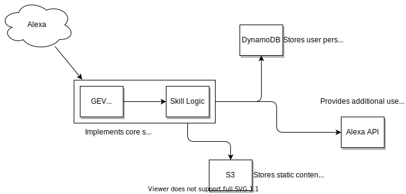
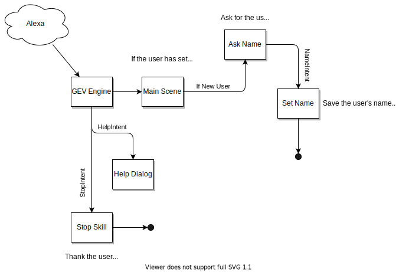

# New skills start here

A living template for creating new Alexa/Google Skills at Volley.

Utilizes the following technologies:

* Our custom skill engine "GEV"
* Typescript
* Linting via ESLint
* Terraform (Easily deploy to both staging and prod environments)
* Tests

[For setup instructions, skip to Getting Started](##GettingStarted)

## Architecture Specification

As you build out your application, you're encouraged to update these architecture diagrams to match how your software grows and adapts to larger challenges, in a way that makes sense for your project and team. Diagrams are in `./docs/` and can be easily modified via the [Draw.io VS Code Extension](https://marketplace.visualstudio.com/items?itemName=hediet.vscode-drawio).

### System Architecture

The default system architecture is simple, with the GEV service depending on only a few external services for persistent data and content management.



### Software Architecture

We divide business logic into a set of semantic "scenes" that transition between each other based on both persistent logic as well as user input.

Each of these scenes interact with plugin-defined interfaces that introduce more advanced capabilities into the application.



## Getting Started

### A note on Prefix Permissions

Volley uses a AWS IAM permission system based on prefixes. Each project and its maintainers have permission to create, modify, and deletes cloud resources that start with a given prefix. Each user on our AWS account automatically gets the prefix associated with their AWS username.

In other words, if your AWS IAM username is `"foobar"`, you will be able to create a project called `"foobar-quiz"`, along with all of the associated AWS resources, like `"foobar-quiz-users-table"`, and `"foobar-quiz-cluster-manager"`, etc.

We say this here because your project must be granted IAM permission based on prefix:
- If your project is a temporary one, it must start with your AWS username.
- If starting a new permanent project, follow section [IAM for new Project](#iam-for-new-project)

### Installing Dependencies

* If you're on macOS BigSur+ all of the tools below can be installed using [volley-ansible](https://github.com/Volley-Inc/volley-ansible).
* Ensure your AWS developer keys are under `~/.aws/credentials` and that your default AWS region is set to `us-east-1`
  * Make sure you've installed the AWS command line tools (<https://docs.aws.amazon.com/cli/latest/userguide/install-cliv2.html>), which will prompt you for the above credentials.
* Ensure `ask` is configured with your Amazon Developer account (this is different than AWS!)
* Ensure that you have an SSH key associated with your GitHub account
* Register for an [npm](https://www.npmjs.com) account and do `npm login` on the terminal.
* Talk to Mike to get your npm account added to the organization
* Install some dependencies:
  * Make sure you have `node` - you can install using [nvm](https://github.com/nvm-sh/nvm)
  * Install and initialize the [ask-cli](https://www.npmjs.com/package/ask-cli)
  * Install the [jovo-cli](https://www.jovo.tech/docs/cli)
  * [Install](https://formulae.brew.sh/cask/gactions#default) `gactions` and `gactions login`.
  * Install [terraform](https://learn.hashicorp.com/tutorials/terraform/install-cli?in=terraform/aws-get-started)

### Initializing your Project

* Click the big friendly "Use This Template" button above. Make sure the name of new repo is 35 characters or less.
* Clone the repo: `git clone git@github.com:volley-inc/{your-repo-name}.git` (or use the GUI)
* Run the friendly configuration script: `./configure.js`
  * You will then be prompted to provision all of your AWS/Alexa Skill/Google Action resources. You should probably say yes.
  * If you opt to hold off, you can always trigger the first deployment via `./setup_terraform.js`
* Docker images on ECR and Deployments
  * Docker images are built on Github Actions and pushed to ECR
  * Hence git commit the changes so far and run `npm version patch` to kickoff `v0.0.1` image build. Which is also default first version in both staging and production k8s manifests. Afterwards follow the section below on [Kubernetes](#kubernetes) to complete deployment.
* Run some of the NPM scripts!
  * `npm run gev:upgrade`: Grabs latest GEV dependencies
  * `npm run build`: Compiles your code
  * `npm run apply:staging`: Create staging AWS resources
  * `npm run apply:production`: Create production AWS resources

## Local Development Loop

Follow these steps in order to run and test your skill code locally with a Live Reload development cycle.

1. Install the [Alexa Toolkit Extension](https://marketplace.visualstudio.com/items?itemName=ask-toolkit.alexa-skills-kit-toolkit) for VSCode
2. Go into the VSCode settings and enable your preferred [auto attach](https://code.visualstudio.com/docs/nodejs/nodejs-debugging#_auto-attach-feature) settings. `(Ctrl + Shift + P > Select "Debug: Toggle Auto Attach" > Select "Only with Flag")`
3. Sign into your Volley Amazon Developer account (with access to the Alexa Developer Console)
4. Open up your fully initialized project in VSCode. If you've already run `npm run deploy:staging`, the Alexa Extension should automatically detect your skill.
5. Run the task `(Ctrl + Shift + P > Select "Run Task" > Select "Watch & Run Interceptor")`
   * This will spin up 2 subtasks
   * The first process will run your skill server locally using `ts-node-dev`, exposing an endpoint at `localhost:8080`. This will also watch for code changes, and will live reload the server! VSCode should auto-attach to this process, allowing you to add breakpoints and hit `debugger` statements.
   * **NOTE:** This is a little buggy with initial build on startup at the moment. For now, try saving a couple of files to get the process to refresh itself. Wait for the terminal to read `Listening on port 8080...`
   * The second process will talk to Amazon servers to route console requests directly to your local machine
6. Once both processes are up and running, you can test your local code by either going to developer.amazon.com, or by opening up the Alexa Toolkit Extension and go to Test skill > Open simulator to have an Alexa console open up right in VSCode.
7. Whenever you're done, you can either manually end the tasks, or you can use the shortcut task Run Task > "Terminate All Tasks".

## Existing Skill Migration to Local Development

1. run `npm install @volley/ask-sdk-local-debug`
2. Copy the [tasks.json](https://github.com/Volley-Inc/gev-starter-kit/blob/main/.vscode/tasks.json) into your project's .vscode folder
3. Add `export const IS_LOCAL_DEV = process.env.IS_LOCAL_DEV;` to your Env.ts
4. Add this snippet into your Engine.ts:

```ts
const handlerOptions: EngineHandlerOptions = {};
if (IS_LOCAL_DEV) {
  handlerOptions.port = 8080;
}
export const engineHandler = new EngineHandler(engines, handlerOptions);
```

5. (Optional) Copy over [EnvironmentNotifier.ts](https://github.com/Volley-Inc/gev-starter-kit/blob/main/src/util/EnvironmentNotifier.ts) and a call to it at the beginning of your skill.
6. Follow the steps in the [Local Development Loop](#local-development-loop) section.

## Uploading your model to Alexa

Because Jovo and the Ask CLI are currently fighting with the npm environment, your best bet is to call the following commands directly.

* `jovo build --stage [staging|prod]` -- locally transpiles your module file into alexa/google configs
* `jovo deploy --stage [staging|prod]` -- uploads your local configs to Alexa & Google (if enabled).

# Kubernetes

## Getting Started

Follow [Kubernetes](https://www.notion.so/volley/Kubernetes-27985bdbacd64f9a989c0bc7f1970622) documentation to setup your k8s environment.

## Onboard your Project to Kubernetes

When your project is a personal project, deploy Kubernetes manifests to your personal namespace (same name as IAM username, for example, Himanshu would deploy to `himanshuneema` namespace).
Otherwise, to provision staging and production namespaces submit [Kubernetes Onboarding](https://forms.gle/HBbNYsbk3pvowqYe9) form.

## Builiding Docker Image

### Tagged with semver `v<major>.<minor>.<patch>` for production
0. It is desired to always publish new [semver](https://semver.org/) versions on `main` branch.
1. Publish a new tag on github by running `npm version patch`, this new tag causes Github Actions workflow to publish new image on ECR.
2. Check `#builds` slack channel and wait for `STATUS` to be `SUCCESS`. On `FAILED` status check Github Actions workflow logs for debugging.

### Tagged with `dev-<short-github-sha>-<timestamp>` for staging

Push any commit to `dev` branch.

## Deploying to Kubernetes

### Deploying Personal/Temporary Project

Use `kubectl` to directly apply k8s manifests to the cluster:

```
# Update context to personal namespace
kubens <your-IAM-username>

# Apply staging manifests
kubectl apply -f ./kubernetes/staging
```

Similarly, you can also apply `kubectl apply -f ./kubernetes/production` -- although this doesn't really make sense for personal projects. If you do end up deploying production too - then make sure to update endpoint in Alexa console appropriately.

To cleanup k8s resources run `kubectl delete -f ./kubernetes/<environment>`.

### Deploying Production or Staging

We use GitOps to deploy to staging and production. Hence, once you onboard namespaces, manifests in `./kubernetes` directory are continuously
synced/applied to cluster in respective namespaces. And your `main` branch acts as
source of truth on "what is deployed?". Hence deploying your changes in `./kubernetes` directory is as simple as merging your PR to `main`.

#### Staging and Continous Delivery

Directory `./kubernetes/staging` on `main` branch is synced to project's staging namespace.

Whenever you push a change to `dev` branch its image is automatically built by Github Actions [cd.yaml](.github/workflows/cd.yml) with format `dev-<short-git-sha>-<timestamp>` which then `fluxbot` uses to update image tag in `kubernetes/staging` directory and pushes it to Github. Which then is synced to cluster as usual.

#### Production

Directory `./kubernetes/production` on `main` branch is synced to project's production namespace.

Other than k8s and AWS resources, for production come and talk to Aaron or Mike. We intentionally left this out of the starter configuration.

## DNS / Endpoint

A DNS record for your project on k8s is automatically created based on `hostName` Ingress parameter in `./kubernetes/<environment>` directories.
Hence, make sure that DNS (`hostName`) doesn't collide with exisiting DNS names.

Use it to configure endpoint on Alexa Development console. The public DNS will be in the format:
- `<project-name>.volley-services.net` for production.
- `<project-name>-staging.volley-services.net` for staging.

## K8s Documentation

For details on all k8s topics check respective documentation:
- [Observability](https://www.notion.so/volley/Observability-adcbcbc494bb43f1a306c885af31c859)
- [Application Operator Guide](https://www.notion.so/volley/Application-Operator-Guide-e1792d05b9e14cd6b43649fdce36a785)

## Branching strategy `dev` vs `main`

Following is the branching strategy we use at Volley:

### `main`

For all your infrastructure components `main` should be source of truth:
- Kubernetes manifests in `./kubernetes/` directory
- Terraform configuration in `./terraform/` directory

The distinction between resources for production and staging is done through subdirectories.

### `dev`

The purpose of `dev` is for code development and not infrastrucutre. Its on `dev` that you send PRs for bug-fixes, new features etc. for review - which is then auto deployed to staging as described in previous sections.

When you need to deploy to production - you merge changes to `main` from `dev` and create a new docker image tagged with `v<something>` through `npm version patch` (or appropriate `npm version <subcommand>` for version you want to update). Which then you use to update `./kubernetes/production/` manifests on `main` to actually deploy.

# Alerting on Session Failures

To monitor and get alerted on Slack when percentage session failures (or absolute count) are above a threshold uncomment the Terraform `alert` module call in `terraform/production/alert.tf` and apply terraform.

For detailed documentation of `alert` module input refer to [README.md](https://github.com/Volley-Inc/gevops/blob/main/terraform/alert/README.md)

# IAM for new Project

When starting a new permanent project send PR to [volley-infra](https://github.com/Volley-Inc/volley-infra) in `aws/iam` directory, with following contents:

  1. A file `my-project.tf`:

      ```
      module "my_project" {
        source     = "git@github.com:Volley-Inc/terraform-volley-iam.git?ref=<use-latest-version>"
        group_name = "my-project-owners"

        users = [
          "<your-IAM-username>",
        ]

        iam_role_users = [
          "aaronsarazan",
          "himanshuneema",
        ]

        prefixes = [
          "my-project",
        ]
      }
      ```

  2. Output for Github Actions keys in `outputs.tf`:

      ```
      output "my_project_ci_keys" {
        description = "AWS access Id & secret for CI"
        value       = module.my_project.ci_iam_keys
        sensitive   = true
      }
      ```

  3. Once your PR is approved, request James to apply it.

## Example IAM PRs
 - [box-of-cats](https://github.com/Volley-Inc/volley-infra/pull/58)
 - [music-quiz](https://github.com/Volley-Inc/volley-infra/pull/48)

# Dependabot
[Dependabot](https://dependabot.com/) is a dependency management bot that will automatically create PRs when dependencies in your `package.json` are updated. The dependabot cofiguration is in `/.github/dependabot.yml` and is already set up to create PRs when a GEV-related dependency updates. To add yourself as a reviewer to these PRs, add your github username to the config file under reviewers.
```yml
reviewers:
  - poteat
  - ryan-fornara
```

# Discussion

Here we'll try to lay out the arguments for many of these decisions, and also give you some context into how everything is set up.

### Typescript

This project attempts to codify some of the best practices for using typescript, mostly via lint rules. It also generates source maps for easy logging. All compilation is done via tsc and keeps external tooling to a minimum.

### Linting

Once a developer has internalized a style guide, mental energy otherwise used on formatting is freed up for writing more code. It also precludes code reviews focusing on style.

### Terraform

Let's start deploying responsibly: discrete environments for staging and production deployments, with fully sandboxed data and services. Terraform gives us the ability to do all of this with moderate effort and try-harding.

### Tests

TODO

# FAQ - Common Errors and How to Fix Them

## WSL Error for Local Interceptor Development

 I'm trying to get Local Development Loop working but when I do `(Ctrl + Shift + P > Select "Run Task" > Select "Watch & Run Interceptor")` I get this error!
    > The terminal process "C:\WINDOWS\System32\wsl.exe -e npm run local:watch" failed to launch (exit code: 1).

---

This is related to running VS Code in Windows and not WSL:

* Make sure you are running your VSCode from "WSL's Context"
    1. Launch your WSL terminal
    2. `cd` into your project directory
    3. While inside of your project root directory, execute command `code .`
* A VSCode should launch, and to verify, check the top bar and you should be able to see something like this

  ```sh
  Setup.ts - gev-volley-fm [WSL: Ubuntu] - Visual Studio Code
  ```

* Give it another go! `(Ctrl + Shift + P > Select "Run Task" > Select "Watch & Run Interceptor")`

## Invalid Invocation Name

* I receive the following error when deploying with Jovo:

```sh
[ERR] smapiUpdateInteractionModel:Server cannot process the request due to a client error e.g. the input
 ›   interaction model is invalid.
 ```

 ---

This may occur when your initial project name had a word like `"alexa"`, `"start"`, `"skill"`, etc. We generate an invocation name for you based on the project name, and invocation names have disallowed words. To fix this, change your invocation name in `"./models/en-US.json"`

## Generic Unhandled Promise Errors

* I receive the following error when trying to execute or initialize the skill:

```sh
UnhandledPromiseRejectionWarning: Unhandled promise rejection (rejection id: 1): Error
```

---

This is likely related to an application-specific bug with GEV itself or one if its dependencies - try running `npm run gev:upgrade` or `npm run upgrade`, which will respectively update the GEV-related dependencies, and all dependencies.

Upgrading using these scripts can have some risk, as they upgrade even across breaking changes, however that usually doesn't cause any issues.

## Missing Volley NPM Packages

* I receive a 404 error for @volley npm packages

---

This very likely means you haven't logged into npm, or haven't gotten permission npm to access our private npm packages. You can run `npm whoami` to see if you're logged in properly.
